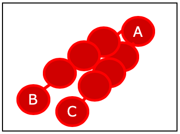

# サンプリングの手法

- アンダーサンプリング
- オーバーサンプリング
- 過去のデータを学習データに加える

---

# アンダーサンプリング

- 少数派のデータ件数に合うように多数派データからランダムに抽出する方法
- 直感的でわかりやすいが、特徴量の分布が崩れる可能性がある

  →対策として、多数派のデータを対象にクラスター分析を行い、特徴量が類似するデータ同士で群を作成、群単位にランダムにデータを抽出する

**今回は、元データが少なく難しい？**

---

# オーバーサンプリング

- 少数派のデータをもとに不足分のデータを補完する
- 少数派データを複製した場合、過学習を起こしやすい。新たなデータを作る場合、分布や特徴量間の相関など考慮する点が多く、実装が大変そう。

  →SMOTE

---

# SMOTE とは

1. データを抽出
2. Aの近傍点であるB、Cを探索
3. AB、AC間にランダムでデータを作成する

---

# imbalanced-learn

- 不均衡データに対するリサンプリング手法をいくつか提供してくれている、scikit-learn依存のライブラリ

参考
[official document](https://imbalanced-learn.org/stable/)
[GitHub](https://github.com/scikit-learn-contrib/imbalanced-learn)
[example](https://ohke.hateblo.jp/entry/2017/08/18/230000)

---

# 過去のデータを学習データに加える

データの傾向について

---

# 参考記事

- [不均衡データに対するClassification](https://qiita.com/ryouta0506/items/619d9ac0d80f8c0aed92)
- [【リレー連載】わたしの推しノード –機械学習時代の申し子「SMOTEノード」が不均衡データの壁を突破する](https://www.ibm.com/blogs/solutions/jp-ja/spssmodeler-push-node-10/)